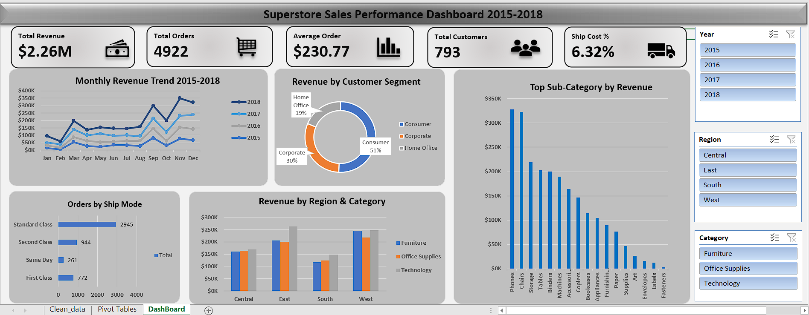

# 📊 Superstore Sales Performance Dashboard

## 👋 About This Project
This is my first Data Analytics project.
I built an interactive Excel dashboard
analyzing 4 years of US retail sales data
(2015-2018) to find business insights.

## 🛠️ Tools I Used
- Microsoft Excel (Advanced)
- Power Query — data cleaning
- Power Pivot + DAX — KPI measures
- PivotTables and PivotCharts
- Interactive Slicers

## 📁 Dataset
- Source: Kaggle Superstore Dataset
- 9,800 rows | 4 regions | 3 categories
- 793 unique customers
- Time period: January 2015 — December 2018

## 🔍 What I Did Step by Step
1. Loaded raw CSV using Power Query
2. Cleaned data — fixed dates, filled
   missing postal codes, removed extra columns
3. Created 7 new calculated columns
   (Year, Month, Quarter, Shipping Days,
   Sales Tier, Est Ship Cost)
4. Built 12 DAX measures in Power Pivot
5. Created 5 PivotTables and 5 charts
6. Built interactive dashboard with
   3 synchronized slicers

## 📈 Key Business Findings
| Finding | Detail |
| Total Revenue | $2.26M over 4 years |
| Revenue Growth | +50.5% (2015 to 2018) |
| Top Category | Technology ($827K — 36.6%) |
| Top Region | West ($710K — 31.4%) |
| Peak Month | November every year |
| Best Segment | Consumer (50.8%) |

## 💡 Business Recommendations
1. **Prioritize Technology upsell** to
   Corporate clients in West and East regions
2. **Expand in South region** — high avg
   order value ($243) but low transaction
   volume shows untapped potential
3. **Prepare inventory early in Q3** —
   November alone = 16% of annual revenue

## 📚 What I Learned
- How to clean real messy data in Power Query
- How to build DAX measures in Power Pivot
- How to design an interactive dashboard
- How to derive business insights from data
- How to tell a story with numbers

## 📂 Files in This Repository
| File | Description |
|---|---|
| Superstore_Sales_Dashboard.xlsx | Main Excel dashboard |
| superstore_raw.csv | Original raw dataset |
| dashboard_screenshot.png | Dashboard preview |

## 🙋 About Me
I am learning Data Analytics and this is
my first project. I am actively looking
for entry-level Data Analyst opportunities.

🔗 Connect with me on LinkedIn:
https://www.linkedin.com/in/vinayak-tailor-9bb507298/
